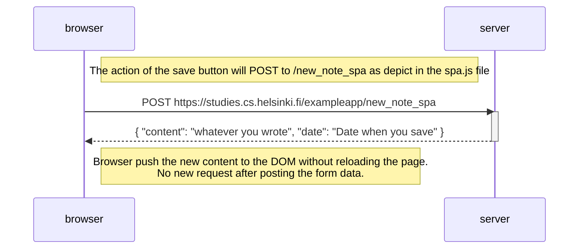

```mermaid
sequenceDiagram
    participant browser
    participant server

    Note right of browser: The action of the save button will POST to /new_note_spa as depict in the spa.js file

    browser->>server: POST https://studies.cs.helsinki.fi/exampleapp/new_note_spa
    activate server
    server-->>browser: { "content": "whatever you wrote", "date": "Date when you save" }
    deactivate server

    Note right of browser: Browser push the new content to the DOM without reloading the page.<br/>No new request after posting the form data.
```
